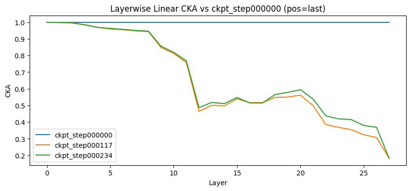
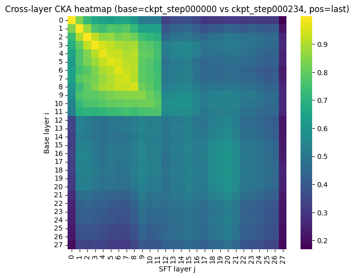
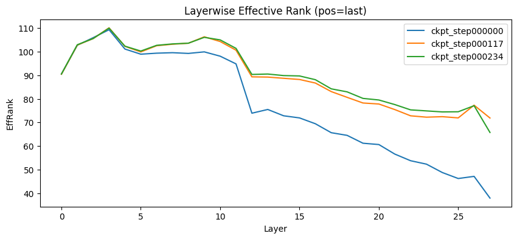
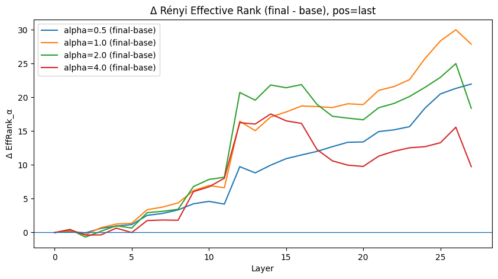
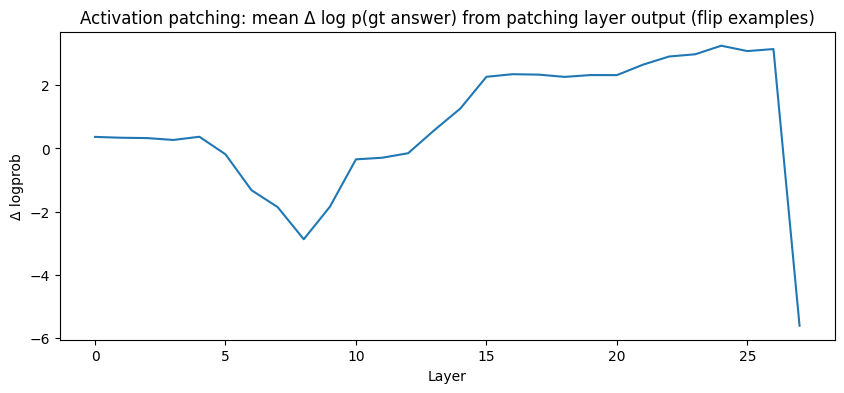

# align-drift
align-drift measures how post-training (SFT, DPO, GRPO) shifts an LLM’s behavior and internal representations. It uses CKA/spectral-rank probes and mechanistic patching/ablation to localize where alignment drift is implemented across layers.

## align-drift-1-SFT: Representation Drift + Causal Localization

I ran a focused representation + causality study on Qwen3-0.6B to understand where supervised fine-tuning (SFT) implements performance improvements, and what that implies for “alignment drift” inside the network. The setup is simple: take a base checkpoint and multiple SFT checkpoints, evaluate on a fixed GSM8K-style set, and analyze internal states layerwise.

## Experimental Setup
### Model + Training

- **Base model**: Qwen3-0.6B

- **Objective**: standard supervised fine-tuning (next-token cross-entropy) on reasoning-style data (e.g., GSM8K formatting in the notebook pipeline).

- **Checkpointing**: intermediate checkpoints are saved periodically to enable time-resolved drift analysis.

## Key Observations and Analyses

### 1) Drift is highly localized: early layers are stable, mid/late layers move

Layerwise CKA similarity between base and SFT hidden states stays near 1.0 through the early stack, then shows a sharp break around the middle layers (~11–13) followed by steadily increasing divergence toward the top. This indicates SFT does not rewrite token-level feature extraction broadly; it primarily modifies computation closer to decision-making (late residual stream). 

I computed CKA similarity between hidden-state representations of:

- base vs each SFT checkpoint (within-layer CKA)

- base layers vs fine-tuned layers (cross-layer CKA heatmaps)

**What this tests**: whether SFT produces uniform drift or depth-localized change; whether layers remain “plug-compatible” or undergo layer remapping (off-diagonal alignment).

**Typical pattern observed**:

i) Early layers remain comparatively stable.
ii) A mid-depth region shows a noticeable drop (a “transition”).
iii) Late layers drift most, consistent with SFT modifying decision circuitry close to the LM head.

### 2) Cross-layer CKA heatmap suggests partial layer remapping post-transition

The cross-layer CKA heatmap isn’t just a diagonal “same-layer matches same-layer” pattern after fine-tuning. Post-transition, base layers often align best to a narrower band of SFT layers, consistent with a basis reparameterization / remapping: mid-stack representations are no longer plug-compatible with the base model’s downstream computation.

The base-vs-final cross-layer CKA heatmap is not purely diagonal:

- Early block (low layers) is strongly diagonal/high-similarity → stable mapping.

- After the mid-stack transition, similarity becomes more diffuse with bands/off-diagonal structure, suggesting that representations are no longer layer-aligned 1:1.

**Interpretation**: downstream computation in the SFT model is operating in a different intermediate basis, i.e., base layer 𝑖 is no longer plug-compatible with SFT layer 𝑖 after the transition.

### 3) SFT increases effective dimensionality late (no representational collapse)

Using spectral diagnostics (effective rank / RankMe and Rényi effective rank variants), SFT checkpoints show higher effective rank in mid-to-late layers compared to the base model. This argues against a collapse-to-few-directions story. Instead, SFT appears to expand (or better utilize) a richer subspace near the output, consistent with more separable task-relevant features.

For each layer and checkpoint, we compute spectral summaries of hidden-state covariance / token-feature matrices:

- effective rank (RankMe-style)

- α-Rényi effective rank / related spectral concentration metrics

**What this tests**: whether SFT collapses representations to a narrow subspace (over-specialization) vs expands usable dimensionality (richer task encoding).

**Interpretation**:

- Higher effective rank in later layers post-SFT suggests more linearly decodable task features rather than a collapse.
- Layerwise spectral shifts provide an orthogonal signal to CKA (similarity can change even if rank stays stable, and vice versa).

### 4) Activation patching localizes causal improvements to late layers (with a mid-layer incompatibility dip)

On “flip” examples (incorrect in base, correct in SFT), activation patching provides causal evidence:

- Early-layer patches have minimal effect on answer likelihood.
- Mid-layer patches can decrease the log-prob of the correct answer (a compatibility mismatch signal).
- Late-layer patches reliably increase the log-prob of the correct answer, localizing the causal implementation of SFT improvements to late computation / output circuitry.

